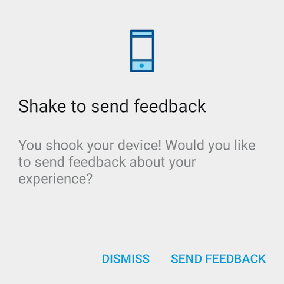

# Shaky
[](https://img.shields.io/github/workflow/status/linkedin/shaky-android/Merge%20checks)

Shake-to-feedback plugin for Android.



Inspired by Google Maps' Shake to feedback and based on Square's
[seismic](https://github.com/square/seismic).

## Download

Download the latest .aar via Maven:
```xml
	<dependency>
	  <groupId>com.linkedin.shaky</groupId>
	  <artifactId>shaky</artifactId>
	  <version>3.0.4</version>
	</dependency>
```

or Gradle:
```
	implementation 'com.linkedin.shaky:shaky:3.0.4'
```

## Getting Started

Add the following to your `AndroidManifest.xml` application tag:

```xml
    <provider
        android:name="android.support.v4.content.FileProvider"
        android:authorities="${applicationId}.fileprovider"
        android:exported="false"
        android:grantUriPermissions="true">
        <meta-data
            android:name="android.support.FILE_PROVIDER_PATHS"
            android:resource="@xml/filepaths"/>
    </provider>
```

Create the corresponding `res/xml/filepaths.xml` resource:

```xml
<paths>
    <files-path name="files" path="."/>
</paths>
```
This allows files captured by Shaky to be shared with external apps. In this case, whatever app
picks up the email Intent. Note: you only need these xml permissions to share files with external apps. For more information see
[FileProvider](https://developer.android.com/reference/android/support/v4/content/FileProvider.html).

In your `Application` subclass:

```java
    public class ShakyApplication extends Application {
        @Override
        public void onCreate() {
            super.onCreate();
            Shaky.with(this, new EmailShakeDelegate("hello@world.com"));
        }
    }
```

For a complete example, see the [demo app](shaky-sample/src/main).

## Advanced Usage

Your app can define custom behavior by subclassing
[`ShakeDelegate`](shaky/src/main/java/com/linkedin/android/shaky/ShakeDelegate.java)
and implementing the
[`void submit(Activity, FeedbackResult)`](shaky/src/main/java/com/linkedin/android/shaky/ShakeDelegate.java#L49)
method (e.g. to send the data to a custom server endpoint).


In addition, you can implement the
[`Bundle collectData()`](shaky/src/main/java/com/linkedin/android/shaky/ShakeDelegate.java#L42)
to collect extra app data including device logs, user data, etc. You will also need to handle how to send the extra data collected in your `submit` method.

If you want to programmatically trigger the feedback collection flow, rather than listening for shake events, you can call `Shaky#startFeedbackFlow()` on the
object returned by `Shaky.with()`. See the demo app for a full example of how to do this.

## Snapshots

You can use snapshot builds to test the latest unreleased changes. A new snapshot is published
after every merge to the main branch by the [Deploy Snapshot Github Action workflow](.github/workflows/deploy-snapshot.yml).

Just add the Sonatype snapshot repository to your Gradle scripts:
```gradle
repositories {
    maven {
        url "https://oss.sonatype.org/content/repositories/snapshots/"
    }
}
```

You can find the latest snapshot version to use in the [gradle.properties](gradle.properties) file.
